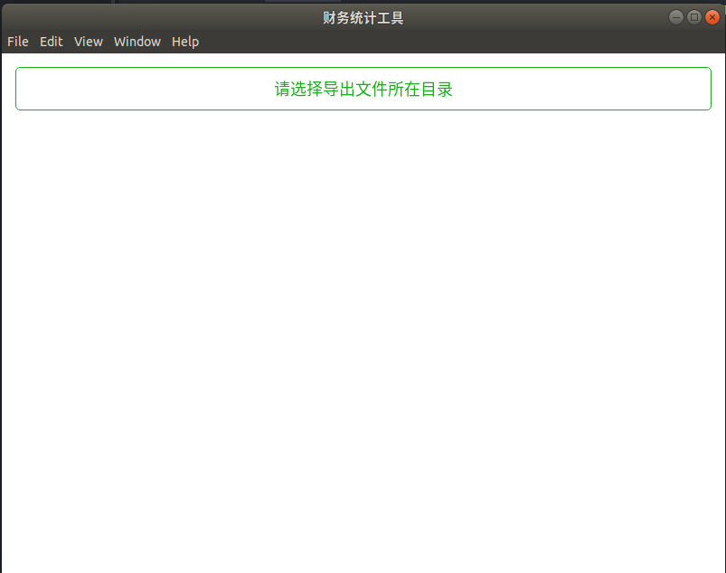
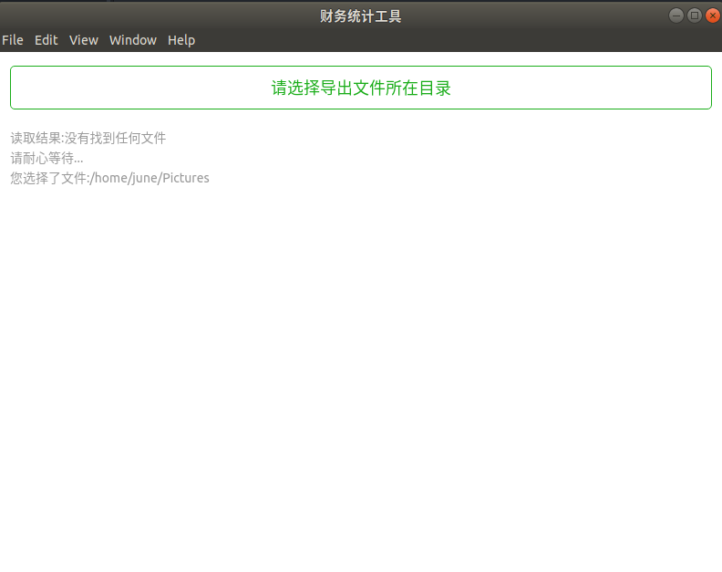

# 从多个Excel提取数据的桌面应用
用Electron写的能同时提取多个Excel文件数据的跨OS桌面应用

财务每隔几天都得从这些石化系统导出的Excel做相关数据统计，工作量大。我便帮她们做个桌面应用。不得不说Electron确实方便，百行代码就解决了。生成的应用在Windows和Linux上都能正常运行。

### 功能
* 从指定目录一次提取所有的Excel，并将分析结果存入新的Excel

### 技术栈
* Electron
* weui

### 使用步骤
* clone到本地，在项目目录里面npm install安装依赖
* 最后npm start即可运行
* npm build发布应用，其中package.json里面的build参数可指定各种OS平台

### 效果截图

